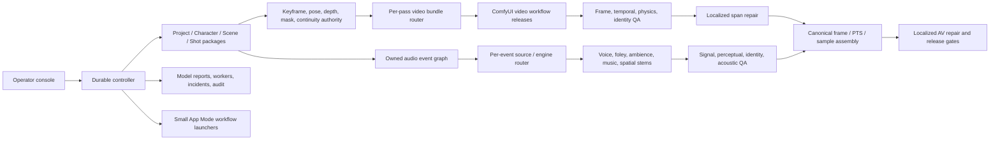

# Wave64 Hyperreal Video, Audio/AV, and Operator Application Third-Pass Master Plan

Updated: 2026-07-16 America/Chicago

## Decision

Build one durable autonomous media controller over many small, immutable,
versioned ComfyUI API workflows. Treat video, audio, and AV as first-class
evidence-bearing products. Deliver the operator experience as a hybrid:

1. a standalone local controller console for projects, timelines, multi-workflow
   DAGs, QA, comparison, repair, model evidence, workers, and audit history;
2. small ComfyUI App Mode views for one workflow's selected inputs and outputs;
3. an optional ComfyUI frontend extension for deep links, node diagnostics, and
   controller status, never as the durable source of truth.

The old idea of one giant App Mode graph is rejected. App Mode exposes a
workflow's chosen controls and outputs; it does not provide durable
multi-workflow orchestration, aggregate state, certificate authority, or
sample/frame-accurate timeline editing.

## Truthful current state

- Existing Wave26-W31 plans contain valuable concepts but many canonical
  architecture files are only short outlines.
- Existing Wave64 sound and speech packages provide strong bounded components.
- Current video engines, sound engines, speech engines, App surfaces, and LLM/VLM
  roles do not become production-authoritative from planning records.
- The durable controller, full operator application, empirical video/audio
  benchmark program, and end-to-end hyperreal AV release are not built.
- Rows261-320 are additive planned obligations. They do not alter Rows001-260.

## End-to-end product graph

## What hyperreal video means

Hyperrealism is a blocking scorecard, not a single aesthetic number. A clip
fails when any release-critical dimension fails even if its average is high.

Required dimensions:

1. identity stability across view, expression, occlusion, lighting, and time;
2. anatomy, pose, hands, face, gaze, and joint dynamics;
3. surface-anchored skin, hair, fabric, accessory, and material detail;
4. camera path, lens, exposure, rolling shutter, focus, depth of field, and blur;
5. lighting, shadow, reflection, white balance, and color-transform continuity;
6. primary, micro, secondary, contact, compression, rebound, and settling motion;
7. multi-character ownership, occlusion, separation, and contact reciprocity;
8. environment, prop, wardrobe, fatigue, wetness, damage, and long-form state;
9. calibrated perceptual realism under autonomous blinded critic evaluation.

Human blind visual or listening comparison belongs only to the optional
`independent_perceptual_calibration` profile. Its absence cannot block or revoke
the `core_autonomous_runtime` decision.

Texture detail must follow the represented surface. Screen-space noise that
looks like pores in one frame and slides in the next is a defect, not detail.

## Video route and multipass policy

Routing happens for every temporal pass, not once per project. Eligible modes
include keyframe-to-video, image-to-video, text-to-video, reference-guided,
interpolation, extension, localized span repair, temporal refinement, and
upscale. The exact selectable unit is a certified model bundle plus workflow
release plus runtime lock.

Hard filters precede ranking. Planned or similarly named engines are not
eligible. Ranking uses task-specific evidence, identity preservation, temporal
stability, motion adherence, physics quality, repair locality, cross-engine
continuity, cost, evidence freshness, and uncertainty. Close candidates may be
branched within a budget. Missing evidence causes abstention or shadow use.

Cross-engine work transfers decoded frames, keyframes, masks, tracks, depth,
flow, pose, metadata, and canonical clocks through certified bridges. It never
transfers incompatible family latents.

## Video repair policy

Accepted outputs are immutable parents. QA localizes defect spans and owners.
A repair receives write masks, protected masks, boundary keyframes, decode
handles, a materially new hypothesis, and a bounded attempt budget. It rewrites
the smallest failed span, reintegrates it, then repeats regional, boundary, and
whole-clip QA. Ambiguous or non-local failures reroute or stop; they do not
silently become full-clip seed loops.

## What hyperreal audio means

Audio is not "generate one soundtrack." The controller compiles an owned event
graph from dialogue, breath, motion, force, contact, material, environment,
camera/listener, and story state. It routes each event independently among:

- recorded/reference material;
- a local retrieved library;
- procedural synthesis;
- neural sound generation;
- qualified character speech synthesis;
- a hybrid layered construction.

Generated sound is not presumed superior. Short physical transients often
benefit from exact library or recorded layers; long semantic ambience may favor
generation; hero contacts may use a force-matched hybrid.

## Voice and performance chain

Character voice is versioned identity authority. The chain is text
normalization, pronunciation, performance plan, dry speech, phoneme alignment,
identity/intelligibility QA, breath and nonverbal layers, viseme binding,
acoustic rendering, mix, and AV QA. Room effects never hide a failed dry voice.
Breathing, effort, gaze, pose, mouth motion, fatigue, and dialogue intent share
the canonical event and continuity state.

## Foley, acoustics, and spatial audio

Foley binds material pairs, force curves, contact area, velocity, surface state,
body/object resonance, position, occlusion, and visual evidence. Acoustic
rendering separates direct path, early reflections, late reverberation,
directivity, distance attenuation, air absorption, and obstruction. Every
important source remains a nondestructive object or stem. Unsupported camera
pan or room claims remain diagnostic, not promotion authority.

## Mix, master, and AV

The mix graph preserves stems and recipes. Release checks include sample and
true peak, integrated and short-term loudness, loudness range, dialogue
intelligibility, spectral masking, phase, noise floor, clicks/pops, and loop
seams. Delivery profiles choose targets; no universal LUFS target is assumed.

One rational media clock maps PTS, frames, and samples. Container-reported
average frame rate is observational metadata, never timing authority. Sync
tolerances vary by event class. Repairs may shift, time-stretch within bounded
limits, pad, crossfade, regenerate one event, repair a mouth span, or remux. The
accepted video and audio parents remain immutable.

## Autonomous intelligence

The LLM may propose project, shot, event, pass, route, and repair plans. It must
cite retrieved registries and evidence, emit strict schemas, report uncertainty,
and abstain when required. Deterministic validators own compatibility and
structural correctness. Calibrated specialist critics observe. Promotion is a
separate policy transaction. No LLM or VLM self-certifies or self-promotes.

## Application product areas

The controller console includes:

- Home and readiness;
- Projects and revisions;
- Character Library;
- Scene Builder;
- Shot and multi-track Timeline;
- Pose, depth, masks, ownership, and contacts;
- Image workspace;
- Video workspace;
- Audio workspace;
- AV assembly workspace;
- Runs, DAG, attempts, queue, and recovery;
- QA, synchronized comparison, annotations, and repair;
- Models, capabilities, benchmarks, and route explanations;
- Runtime workers, locks, leases, storage, and incidents;
- Assets and lineage;
- Settings, policies, roles, and audit.

Guided, Director, Expert, and Diagnostic modes progressively disclose detail.
Raw paths, credentials, internal node IDs, and direct database/runtime mutation
are hidden. Expert mode exposes evidence and exact bundle identity, not unsafe
authority.

## Timeline design

The timeline is the shared editing surface for shots, camera, characters, pose,
masks, contacts, keyframes, video passes, defects, dialogue, voice, breath,
foley, ambience, music, mix automation, and promotion state. Edits are
versioned transactions with optimistic concurrency, undo records, validated
spans, and deterministic recompilation. The UI does not edit generated files in
place.

## Delivery phases

1. Canonical schemas, registries, clocks, and synthetic fixtures.
2. Controller API and projection model with fake ComfyUI/audio adapters.
3. App shell, navigation, project library, and read-only run/DAG views.
4. Character/Scene/Shot/Timeline publishers and typed commands.
5. Single-character video preview, frame manifest, and temporal QA.
6. Two-character ownership/contact video plus local span repair.
7. Audio event graph, source routing, voice, foley, acoustic stems, and QA.
8. Sample-accurate AV assembly and local AV repair.
9. Compare, explain, repair, model, runtime, and incident workspaces.
10. Accessibility, visual regression, fault injection, performance, and security.
11. Empirical engine qualification and shadow autonomous routing.
12. End-to-end release certification after every external gate passes.

## Rows261-320

Fifteen four-row workstreams implement contract, policy, implementation, and
assurance obligations. The final Row320 release depends transitively on every
new row and externally on the existing multimodal runtime, Model Intelligence
production-selection release, current MaskFactory authority, and perceptual
release evidence. Planning work may proceed with synthetic fixtures while the
bulk model library remains deferred.

No planning file, passing static test, or UI mockup proves runtime completion.
