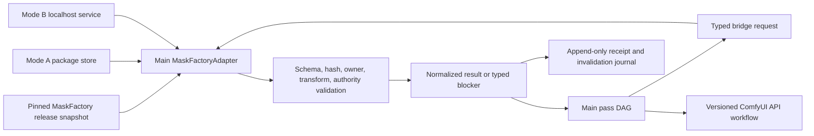

# Wave64 MaskFactory Autonomous Bridge and Release Handshake Master Plan

Updated: 2026-07-17 America/Chicago

## Decision

The Main ComfyUI project and the Ultimate MaskFactory project integrate through
one authority-preserving bridge with two independent surfaces:

1. a runtime/data bridge owned by the Main controller through a typed
   `MaskFactoryAdapter`; and
2. a project/session coordination bridge based on immutable, hash-bound release
   snapshots, consumer requirements, adoption receipts, compatibility tests,
   and invalidation events.

The two repositories remain independently versioned. They do not share mutable
source files, consume each other's dirty worktrees, infer truth from filesystem
location, or directly edit each other's trackers. ComfyUI nodes are thin
workflow helpers; they are not cross-project authority, durable orchestration,
or promotion gates.

This package adds Rows321-348. It refines and operationalizes existing
Rows177-180 without rewriting them. Row348 is also gated by the existing
Character-to-Image vertical slice in Row218.

## Correct completion boundary

Three completion profiles are deliberately separate:

| Profile | Criticality | Meaning |
|---|---|---|
| `core_autonomous_runtime` | Required | Autonomous prediction or package acquisition, deterministic validation, critic QA, bounded repair, abstention/quarantine, typed authority, API/package integration, restart safety, and end-to-end ComfyUI consumption. |
| `independent_real_accuracy` | Optional | Human-anchor/CVAT or independently labelled evaluation used only for externally defensible real-image accuracy statistics. |
| `scale_daz_maturity` | Post-core optional | Large corpus growth, broad DAZ qualification, long soak tests, and scale/research maturity. |

Neither optional profile may silently become a prerequisite for
`core_autonomous_runtime`. Human-anchor masks are one optional issuer class,
not the default or required authority path. Autonomous MaskFactory certificates
can authorize core runtime use when their exact scope and evidence satisfy the
consumer policy.

## Frozen wire vocabulary

`access_mode` and authority are orthogonal.

- Access modes: `mode_a_package_read`, `mode_b_live_predict`,
  `mode_b_live_refine`.
- Authority states: `invalid`, `hypothesis`, `draft`,
  `qa_passed_noncertified`, `certified`.
- Issuer kinds: `maskfactory_autonomous`, `human_anchor_optional`, `none`.

Mode A describes package access, not certification. Mode B describes live
service access, not permanent draft status. The currently implemented Mode B
surface remains capped at `draft` until an exact serving-route/output
certificate proves a stronger state. No component may infer authority solely
from Mode A, Mode B, a `gold` directory name, a confidence score, a UI label,
or a model family.

## Runtime/data bridge



The controller compiles `AcquireMask -> ValidateBinding -> ExecutePass`. The
adapter returns one normalized result regardless of access mode while retaining
source, route, provider, model, release, package, certificate, owner, transform,
and mask lineage. An unavailable service blocks only the dependent pass.
Unrelated DAG branches continue. There is no silent fallback and no direct
write from Main into MaskFactory gold/certified package authority.

Every request binds:

- correlation, job, pass, attempt, scene, shot, and take identifiers;
- source artifact identity, SHA-256, dimensions, color space, and coordinate
  space;
- character instance, provider person index, target/protected ownership, mask
  intents, and requested ontology labels;
- crop, resize, pad, flip, projection, and inverse transform expectations;
- exact release, schema source/version/hash, API, package, ontology, node-pack,
  and optional wheel bindings;
- minimum authority, accepted issuer kinds, certificate scope, deadline,
  idempotency key, and promotion intent.

Every result binds the same scope plus exact output hashes, mask type and
coordinate space, transform roundtrip evidence, route/model lineage,
certificate or non-certification reason, QA observations, typed blockers, and
cache freshness. The normalized result does not self-declare promotion
eligibility. A separate, hash-bound consumer-policy decision records exact
intended use, required authority, issuer/scope, structured criteria/evidence,
and `eligible_for_intended_use`.

## Contract surface ownership

MaskFactory publishes the producer wire contracts, currently including
`mask_acquisition_request`, `mask_acquisition_receipt`,
`operational_autonomy_certificate`, release/capability snapshots, errors,
adoption/invalidation/feedback, and lifecycle events. Main imports and pins the
exact producer schema name, version, source, and hash from the adopted release.

The strict Main v2 schemas in this package are internal normalized-port and
producer-import validation contracts. They do not replace or impersonate the
producer wire schemas. A complete explicit mapping compiles Main requests to the
producer wire and validates/normalizes producer receipts. An unknown contract,
missing mapping, or unadopted producer hash blocks the dependent pass.

The mapping is generated executable data, not a prose rule ID. It binds exact
producer and Main schema names, sources, IDs, versions, and SHA-256 values;
covers every closed-world top-level field with RFC 9535 source/target JSONPaths;
records required/drop/default/recompute/reject behavior; names versioned
transforms and explicit enum conversions; and forbids authority escalation.
Producer `use_eligibility` is validated and discarded as Main policy authority.
Main recomputes intended-use eligibility through its separately hash-bound
authority-decision contract. Any unknown field, enum, context, or mapping fails
closed.

## Project/session coordination bridge

```mermaid
sequenceDiagram
    participant MF as MaskFactory task
    participant R as Immutable release snapshot
    participant M as Main task
    MF->>R: Publish commit/tag, artifacts, contracts, ontology, capabilities, certificates, revocations
    M->>R: Verify schema source/version/hash and artifact hashes
    M->>M: Pin exact snapshot; run consumer contract tests
    M-->>MF: Publish signed adoption receipt and consumer requirements
    MF-->>M: Publish later release or invalidation event
    M->>M: Invalidate affected cache/routes and revalidate
```

MaskFactory publishes immutable releases; Main imports and pins them. Main
publishes a consumer-requirements manifest that declares supported versions,
labels, person counts, transforms, authority tiers, certificates, and latency
envelopes. An adoption receipt records `adopted`, `partially_adopted`, or
`rejected` with exact evidence. Contract CI in both repositories verifies the
same snapshot. Release, ontology, certificate, champion-route, and revocation
events cause bounded invalidation and revalidation.

For this local personal deployment, signed/hash-bound JSON manifests, a local
HTTP service, pinned Git/release artifacts, and append-only event journals are
sufficient. A distributed message broker is not justified.

## Authority and promotion rules

1. Main never creates or upgrades MaskFactory truth.
2. MaskFactory certificates are accepted only within exact scope, version,
   expiry, revocation, route, output, ontology, and issuer boundaries.
3. A `qa_passed_noncertified` mask may support diagnostic or policy-allowed
   non-promoted work but cannot impersonate `certified`.
4. Mode B cannot overwrite a stronger Mode A result merely because it is newer.
5. A derived union, intersection, refinement, dilation, feather, crop, or
   projection receives new lineage and no stronger authority than policy allows.
   Every normalized mask preserves original/derived lineage, its own authority,
   and each parent's immutable ref, authority, and certificate ref. Actual
   derived operations require parents, originals require none, and child
   authority cannot exceed any parent. Result authority is the minimum of all
   mask authorities.
6. Ambiguous character ownership, person index, schema drift, ontology drift,
   transform mismatch, stale certificate, unknown release, or revoked evidence
   fails closed for the dependent pass.
7. LLMs and VLMs may diagnose, propose requests, compare candidates, and suggest
   repairs. Deterministic validators own structural eligibility; independent
   policy owns promotion.

## Seven four-row workstreams

| Rows | Workstream | Outcome |
|---|---|---|
| 321-324 | Release snapshot and pinning | Immutable producer release, exact consumer pin, drift and revocation checks. |
| 325-328 | Adapter request/result and dual-mode access | Strict request/result envelopes, Mode A/Mode B adapters, normalized arbitration. |
| 329-332 | Authority, certification, and promotion | Frozen crosswalk, scope verification, promotion gate, demotion/invalidation. |
| 333-336 | Ownership, transforms, and repair | Multi-character mapping, transform roundtrips, protected-region lineage, bounded disagreement repair. |
| 337-340 | Resilience, cache, and recovery | Health snapshots, idempotency/circuit breaking, cache freshness, journal replay. |
| 341-344 | Cross-repository/session handshake | Consumer requirements, adoption receipt, compatibility CI, feedback without gold mutation. |
| 345-348 | Assurance and integrated release | Fixtures/faults, observability/App projections, vertical-slice proof, core release gate. |

Rows321-348 remain planned autonomous implementation obligations. Their static
contracts do not claim that the runtime adapter, production service, certified
package corpus, or integrated vertical slice is complete.

Fixture records are usable for contract, transform, fault, and projection
validation, but `fixture_only=true` can never satisfy production operational
certification or Row348. Production certificates/releases require non-fixture
context, non-empty genuine runtime evidence, and the applicable runtime gates.
Planning coverage and fixture hashes cannot be relabelled as runtime proof.

## Autonomous hardening strategy

The autonomous path is an evidence-bearing state machine:

1. retrieve the pinned release snapshot and applicable consumer policy;
2. compile a strict request from an immutable pass plan;
3. reject incompatibility before contacting a provider;
4. execute one eligible access route under an idempotency key and deadline;
5. validate hashes, owner, ontology, coordinate space, transforms, masks, and
   authority independently of provider wording;
6. run deterministic, specialist-critic, regional, protected-region, and
   whole-artifact QA appropriate to the intended use;
7. accept, quarantine, repair, reroute, or abstain with a typed reason;
8. persist the receipt, result, decision, evidence, and cache dependencies;
9. promote only through a separate policy transaction; and
10. learn from results through non-authoritative reports and bounded feedback,
    never by silently rewriting certification policy.

Retries must use a materially changed hypothesis when the prior attempt was a
quality failure. Transport retries reuse the same idempotency key. Unknown
submission state, restart, lease loss, service outage, disk pressure, partial
write, and stale projection are explicit recovery cases.

## QA and release scorecard

Core release requires passing evidence for:

- schema source/version/hash agreement and release artifact integrity;
- Mode A package acquisition and a Mode B draft acquisition/refinement path;
- single- and multi-character owner/person-index isolation;
- crop/resize/pad/flip transform roundtrip and mask alignment;
- target/protected/derived mask lineage and no authority inflation;
- offline, timeout, retry, duplicate, stale cache, revocation, ontology drift,
  schema drift, and restart recovery;
- dependent-pass-only blocking and unrelated-DAG continuation;
- explicit read-only App mappings for Home/readiness, Projects/revisions, Scene
  Builder Pose & Masks, Runs/DAG, Queue/Workers, Recovery, and QA through the
  strict readiness-projection v2 contract;
- an integrated Character-to-Image proof after Row218; and
- independent promotion-gate enforcement.

`independent_real_accuracy` and `scale_daz_maturity` evidence is reported
separately. Neither changes the core release result unless the operator
explicitly selects a policy that requires one of those profiles.

## Delivery order

1. Preserve Rows177-180 and freeze the v2 wire vocabulary.
2. Publish and validate the MaskFactory release-snapshot contract.
3. Implement the Main consumer pin and adoption receipt.
4. Implement Mode A, then Mode B draft, then normalized arbitration.
5. Add authority, certificate, revocation, cache, and typed blocker gates.
6. Prove single-person and multi-person ownership/transform fixtures.
7. Add restart, retry, circuit-breaker, stale-cache, and invalidation tests.
8. Expose read-only bridge state in the controller console and bounded App Mode
   launchers.
9. Execute the Row218 Character-to-Image vertical slice with the bridge.
10. Issue the `core_autonomous_runtime` bridge release certificate only after
    every required gate passes.

No planning file, passing unit test, schema-valid example, or installed node
pack alone proves runtime completion.

## Second-pass hardening freeze

The bridge is planned as a cryptographically and semantically closed system,
not merely a pair of compatible JSON payloads.

1. **Trust is out of band.** Production signatures must use Ed25519 and resolve
   to an active key in Main's separately pinned trusted-key registry. An embedded
   or producer-supplied public key is evidence to compare, never its own trust
   anchor. Release, certificate, invalidation, adoption, and journal-checkpoint
   verification retain the key ID, registry entry hash, algorithm, verification
   time, and evidence reference.
2. **Certificate authority is decision-time authority.** Main evaluates issued,
   expiry, issuer, exact scope, signer state, and the current revocation index at
   the authority-decision timestamp. A later UI refresh, producer eligibility
   Boolean, high QA score, or cached prior decision cannot substitute for that
   evaluation.
3. **Claims are typed.** `operationally_certified_artifact` may support only the
   exact core use allowed by the pinned policy. It never implies independent
   real-world accuracy, human-labelled truth, or training gold.
4. **Input constraints are not outputs.** Target and protected ROI artifacts are
   independently hashed and lineage-bound from generated masks. Hash identity is
   rejected except when Mode A intentionally selects the exact immutable package
   mask and records that selector exception.
5. **Ownership is scene-complete.** Every request declares a roster containing
   the exact target character and all protected characters, props, and the
   environment. Provider indices are scoped to character instances; protected
   ownership cannot silently alias the target.
6. **Transforms are executable contracts.** The ordered chain binds source and
   output coordinate spaces/dimensions, typed operation parameters,
   interpolation, rounding, side-label swaps, inverse strategy, step hashes,
   canonical chain hash, and bounded roundtrip evidence. A descriptive transform
   name is insufficient.
7. **Media authority is exact.** Still images, one video frame, and bounded frame
   spans carry source-media hash, frame/PTS/timebase or span bounds, neighboring
   and temporal evidence, and exact-frame-only authority. A mask certified for
   one frame cannot drift to another frame or a whole clip.
8. **Execution facts remain factual.** Project/run/job/pass/attempt/hypothesis,
   selected route and reason, eligible alternatives, timing, peak RAM/VRAM,
   resource/deadline conformance, and native/venv versus container provenance are
   durable observations. They do not grant promotion authority.
9. **Recovery is signed and fork-intolerant.** Canonical domain-separated events
   form a previous-hash chain with trusted signed bootstrap/checkpoints and a
   pinned head. Deletion, reorder, fork, reseal, checkpoint substitution, or
   substituted signing key is rejected and quarantined. `outcome_unknown` must
   reconcile the original request hash, idempotency key, and remote receipt before
   any new submission.
10. **Canonicalization and imports fail closed.** The exact producer profile name,
    version, and hash are release-bound; UTF-8, duplicate-key rejection,
    non-finite-number rejection, signature domain separation, payload exclusions,
    authentication, nonces, replay windows, archive traversal/link/device-path
    rejection, size limits, post-extract hashing, and atomic activation are
    mandatory compatibility controls.
11. **Autonomous intelligence proposes; contracts decide.** LLM/VLM outputs are
    schema-bound proposals or observations with immutable retrieval evidence.
    Conversation/compaction summaries are not project truth, tool access occurs
    only through the controller gateway, memory writes require validation and
    event-journal admission, and no model may self-promote or mutate producer
    truth.
12. **Readiness is a strict derived projection.** Runtime readiness requires the
    active release/adoption pin, trusted signer and journal state, Row218,
    Rows321-347, Row348, all seven App page projections, genuine non-fixture
    runtime evidence, a ready core profile, and zero core blockers. Optional
    independent-accuracy or DAZ-scale blockers remain visibly separate and cannot
    turn core readiness red.

The producer planning freeze is now final and pinned to MaskingUltimate commit
`938b469`, branch `codex/mask-autonomy-bridge-plan`, PR
`https://github.com/KevinSGarrett/MaskingUltimate/pull/2`, and producer planning
preservation-manifest SHA-256
`13fda3eab823e4a544f171c5570ceed99e77cd246ccbc13e686879616682bde2`
(113 entries). The exact 12 wire-schema hashes are final design-time provenance.
They are not a runtime release: the signed production release remains
`unpublished_unadopted`, and Main must still verify and adopt that future runtime
release before production consumption.

The producer commit above remains the immutable packet identity. MaskingUltimate
PR #2 now has non-rewriting integration head
`e6d6c6bdf00a0702d274455fbf07ded2b3a838b3`, whose parents are the producer
packet and corrected base `85d4c19b7974c1b64f48176d91211defbaba35a0`. Integration reconciliation
manifest SHA-256
`d382e55b6c78deed983a9b56672349f1915fa60a4acd0328f831c2bc84acba77`
accounts for all six base-owned supersessions and two reconciliation-protocol
updates while proving all 12 wire schemas unchanged. The integration head is PR
ancestry, not a replacement producer identity or runtime authority.
PR validation head `30008808957f484b0989329843d72e1c22d044da` adds only the
fresh signed currency-review chain entry required after base-source hashes
changed; it does not alter the producer packet, reconciliation seal, or wire
contracts.

## Model-library activation deferral

The existing Rows223-260 model-intelligence package remains the sole owner of the
7,282-record library. Its state is
`deferred_waiting_for_complete_model_download`. Full dry-run ingestion, pilot
qualification, bundle-solver and benchmark-runner activation, and autonomous
router/LLM/VLM/App model activation are all deferred. The only activation gate is
an explicit user or main-task declaration that the intended downloads are
complete plus exact Main inventory verification. This bridge cannot clear or
bypass that gate, does not duplicate the model-intelligence package, and does not
make the full library a core MaskFactory bridge dependency.

## Final integrity closure

- A production adoption is valid only when both the actual release snapshot and
  adoption receipt are non-fixture, runtime-context records with genuine runtime
  evidence, exact immutable cross-references, domain-separated hashes, trusted
  release/adoption/checkpoint signatures, a fully passing compatibility decision,
  and an active pin. Fixture release or adoption records can never be promoted by
  changing a Boolean.
- Row348 consumes a closed set of exactly 28 immutable gate reports: Row218 and
  every Row321-347. Each report binds its row subject, evaluator manifest,
  evidence, runtime evidence, signature trust, canonical report hash, and exact
  report reference. Row aggregate, signing, journal, release, and completion
  Booleans are recomputed from those reports; missing, duplicate, unknown,
  untrusted, or contradictory reports fail closed.
- App readiness is a cross-document projection of the actual signed release,
  adoption, Row348 certificate, gate reports, journal pin, and evidence—not a
  self-declared summary. Each App page is bound to its registered gate-report set;
  a stale ref, stale gate, altered checkpoint, or incomplete evidence projection
  makes the page and core readiness non-ready.
- Invalidation retains the immutable raw producer payload plus heterogeneous
  per-target old/new authority and certificate states, exact actions, cache
  impacts, causation, idempotency, stream sequence, supersession, replacement,
  and rollback lineage. Adoption revalidation has an explicit fail-closed rule
  for every release/schema/API/ontology/route/model/certificate/artifact/QA,
  signer/trust, capability/promotion-policy/semantic-profile/node-pack, journal,
  and revocation-index invalidation class.
