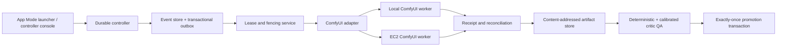

# Wave64 Durable ComfyUI Runtime and Phase-Safe Autonomy Architecture

Updated: 2026-07-16 America/Chicago

## Control boundary

The autonomous control plane owns durable intent, state, leases, idempotency,
evidence, QA, and promotion. Each ComfyUI server is a fenced worker with one
volatile local queue. API workflows are immutable releases compiled from a
canonical UI workflow and bound to an exact runtime lock.

## Submission protocol

1. Resolve a certified exact `model_execution_bundle` and compatible
   `workflow_release_manifest` plus current `comfyui_runtime_lock`.
2. Acquire a `runtime_worker_lease` and fencing token.
3. Persist pass attempt, deterministic prompt UUID, unique idempotency key, API
   body hash, output namespace, and outbox row in one transaction.
4. Connect WebSocket before POST when supported, submit once, and record the
   HTTP receipt. Duplicate UUID behavior is never assumed to be exactly-once.
5. Treat WebSocket events and previews as advisory. On terminal event,
   disconnect, timeout, or restart, reconcile jobs/history/queue/files/CAS.
6. Hash and register every output through a safe relative artifact locator.
7. Commit QA and promotion as separate transactions; ambiguous attempts block
   failover and promotion.

## Workflow and runtime release

Legacy UI v0.4 workflows require deterministic migration to canonical v1,
semantic-equivalence evidence, recursive project-subgraph source hashes, a
flattened API graph hash, explicit input/output bindings, and removal of
top-level `_meta` before submission. Runtime locks bind ComfyUI core, frontend,
Python, Torch/CUDA, startup arguments, packages, each custom-node origin and
commit/dirty diff, import status, node signatures, `/object_info`, feature
probes, and folder-root identities.

## Recovery invariants

- ComfyUI queue/history never replaces the external event store.
- Leases require monotonically increasing fencing tokens.
- A stale worker cannot submit, register, QA, or promote.
- Submission and promotion are idempotent and separately unique.
- Absolute paths and traversal are forbidden at the worker boundary.
- Cross-host failover is allowed only after reconciliation proves the prior
  attempt was never submitted or is terminal and non-promotable.
- App Mode never becomes the hidden source of DAG or promotion state.
