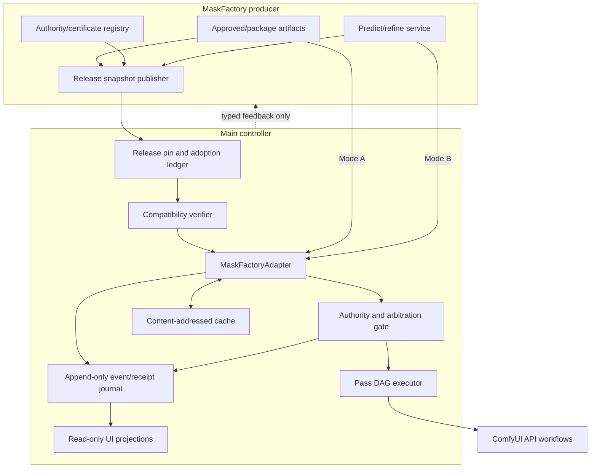
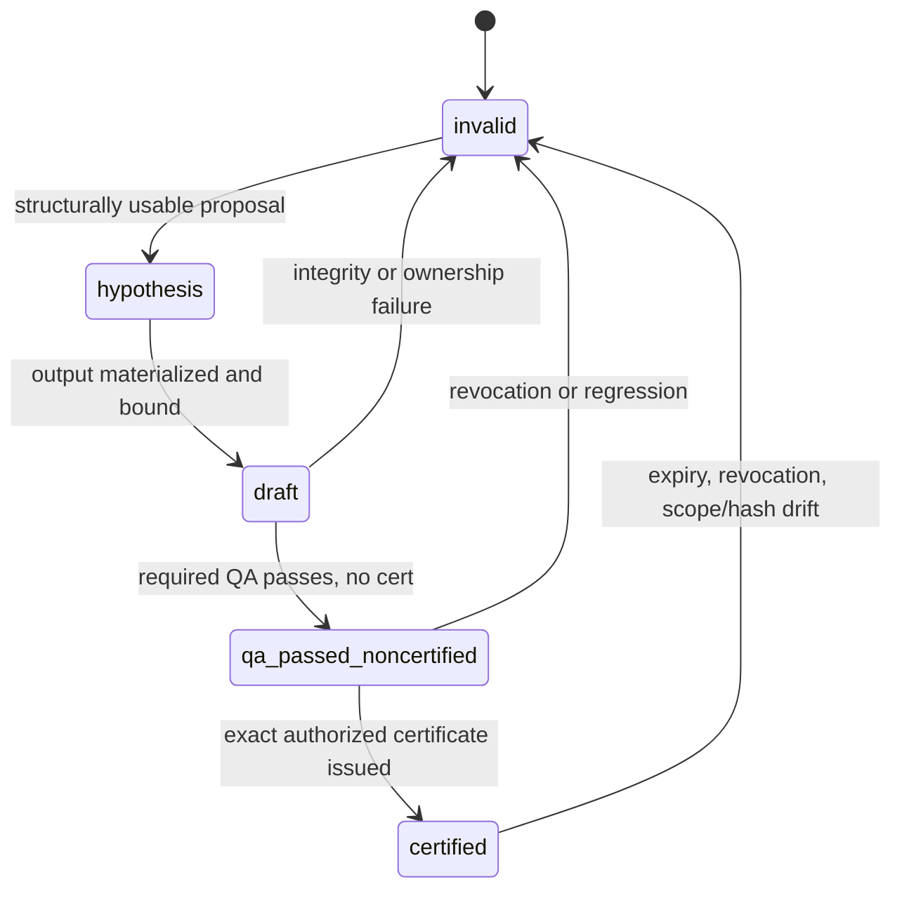
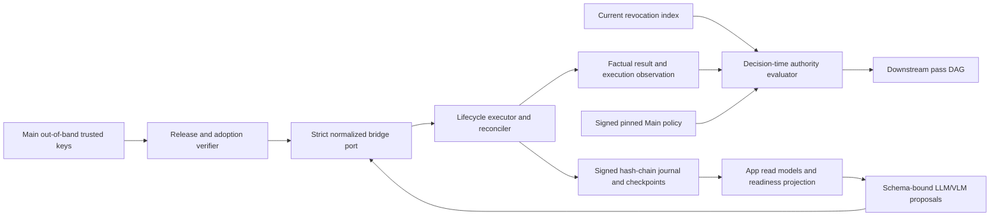

# Wave64 MaskFactory Autonomous Bridge Architecture

Updated: 2026-07-17 America/Chicago

## Architectural objective

Create a reproducible bridge in which Main can autonomously acquire, validate,
route, consume, QA, repair, and promote mask-dependent work without taking over
MaskFactory truth authority. Allow both autonomous tasks to reuse completed
work through immutable releases and receipts, not shared mutable state.

## Bounded contexts

### MaskFactory producer context

Owns:

- package creation, prediction, refinement, ontology, and mask QA;
- MaskFactory authority state and certificate issuance/revocation;
- provider, model, route, package, transform, and output evidence;
- integration release snapshots and producer contract fixtures; and
- responses to typed feedback/repair requests.

Does not own:

- Main scene/pass compilation;
- ComfyUI workflow routing;
- downstream artifact promotion; or
- Main project/tracker mutation.

### Main consumer context

Owns:

- scene/shot/pass intent and character-instance ownership;
- consumer requirements and exact release pin;
- adapter request compilation, transport, idempotency, cache, and recovery;
- independent compatibility and authority verification;
- dependent-pass blocking, downstream QA, and artifact promotion; and
- operator/App projections and route explanations.

Does not own:

- MaskFactory gold/certified package mutation;
- MaskFactory authority upgrades;
- producer ontology or model promotion; or
- interpretation of a dirty MaskFactory worktree as a release.

### ComfyUI execution context

Owns bounded execution of versioned workflows. It may load a package mask or
request a live draft using controller-supplied values. It does not own durable
events, global routing, retries, certificate validation, or promotion.

## Logical components



## Producer release snapshot

The snapshot is immutable and content-addressed. It binds:

- producer repository identity, clean commit/tag, release ID, timestamp, and
  snapshot SHA-256;
- schema source path/URI, schema ID, semantic version, and exact SHA-256;
- API/OpenAPI version/hash and compatible endpoint set;
- package format and ontology version/hash;
- node-pack and optional wheel archive names/hashes;
- model/provider route capabilities and maximum certified authority by exact
  route;
- certificate index, scope, issuer, expiry, and revocation state;
- package/artifact index and hashes;
- completion-profile claims; and
- breaking changes, superseded releases, and invalidations.

A Git tag without artifact hashes is insufficient. A folder hash without
contract identity is insufficient. A release cannot reference mutable `latest`
paths as production authority.

## Consumer requirements and adoption

Main publishes requirements before adoption. They declare exact or bounded
compatible schema/API/package/ontology versions, required labels, person counts,
transform operations, latency limits, access modes, minimum authority, accepted
issuers, and completion profile.

The adoption verifier performs, in order:

1. release snapshot signature/hash and source-clean verification;
2. schema source, `$id`, version, and hash comparison;
3. API/OpenAPI, package, ontology, node-pack, wheel, and route comparison;
4. authority crosswalk and certificate-format comparison;
5. required label, person-count, transform, and latency capability checks;
6. producer and consumer contract fixtures; and
7. adoption decision with exact mismatches and a pinned release reference.

`partially_adopted` may authorize only explicitly named diagnostic/shadow
capabilities. It never becomes broad production compatibility.

## Adapter ports

The controller defines one internal normalized port:

```text
acquire_mask(MaskFactoryBridgeRequestV2) -> MaskFactoryBridgeResultV2
```

Adapters implement:

- package reader for `mode_a_package_read`;
- service client for `mode_b_live_predict`;
- service client for `mode_b_live_refine`; and
- a deterministic blocked result when no route is valid.

The port is Main-owned and is not the MaskFactory producer wire contract. The
adapter first compiles it to the exact adopted producer
`mask_acquisition_request`, then validates the exact producer
`mask_acquisition_receipt` and maps it back. Producer schema name/version/source/
hash and an explicit mapping rule are mandatory; unknown or missing mappings
fail closed.

The mapping is executable data, not a prose rule ID. Each direction binds the
exact producer and Main schema name, `$id`, version, source, and SHA-256, then
enumerates every closed-world top-level field with source and target RFC 9535
JSONPaths, source/target required flags, `map`, `drop`, `default`, `recompute`,
or `reject` disposition, a versioned transform, explicit enum conversion, and
non-escalating authority semantics. Bound producer subtrees are recursively
validated before their named transform executes. Any unknown field, unmapped
enum, missing required field, schema hash drift, or absent mapping blocks the
dependent pass. Producer `use_eligibility` is validated and deliberately
dropped; Main recomputes `eligible_for_intended_use` in the separately
hash-bound `maskfactory_authority_decision_v2` policy context.

The port does not expose raw paths to the LLM or browser. Resolved local paths
remain inside the trusted adapter and are derived from the pinned snapshot.

## Request compilation

The pass compiler supplies immutable identifiers and intended use. It cannot
ask the adapter to certify an output. Required request groups are:

1. correlation: project/run/job/pass/attempt and idempotency;
2. media scope: scene/shot/take/frame/span;
3. source: artifact ID, SHA-256, dimensions, color and coordinate spaces;
4. ownership: character instance, provider person index, target/protected owners;
5. intent: mask purposes, requested labels, visibility/occlusion expectations;
6. geometry: ordered transform chain, inverse requirements, tolerances;
7. compatibility: release and every contract/version/hash expectation;
8. authority: minimum state, accepted issuers, certificate scope;
9. execution: access mode, route preference, deadline, retry class; and
10. policy: diagnostic, preview, repair, or promotion-bound consumption.

## Result normalization

The adapter returns:

- exact request and release binding;
- access route and status;
- package/service/provider/model lineage;
- mask artifacts with hashes, type, coordinate space, owner, label, and
  derivation graph;
- transform chain and roundtrip evidence;
- authority state, issuer kind, certificate reference/scope, expiry, and
  revocation check;
- deterministic and critic QA observations;
- freshness/cache provenance;
- typed blockers and retryability; and
- per-mask factual authority plus a result authority equal to the minimum
  per-mask authority.

Normalization never erases whether data came from package or live service. It
never contains a self-promoting eligibility boolean; intended-use eligibility
exists only in the separate Main policy decision.

## Authority state machine



Transitions are producer-authority events. Main verifies and consumes them; it
does not perform the `certified` transition. Main may independently decide that
a certified mask is unsuitable for one downstream use.

Access mode is not present in the state machine because it is not authority.
Current policy caps uncertified live routes at `draft`. A future live result can
be `certified` only when its exact serving route, model/runtime bundle, source,
output hash, ontology, scope, and certificate are bound.

## Multi-character ownership

Each character receives:

- `character_instance_id` unique within the scene/shot/take;
- provider-specific `person_index` bound by an explicit mapping;
- expected skeleton/depth/silhouette reference;
- target and protected mask ownership;
- visibility, occlusion, and contact context; and
- independent masks and QA.

Provider order is not assumed stable between calls. If assignment cannot be
proven from the request/result evidence, the result is ambiguous and blocked.
No nearest-box heuristic may silently authorize promotion.

## Transform and mask integrity

Every operation records input/output coordinate spaces, dimensions, parameters,
interpolation, rounding, padding, and inverse. The roundtrip validator maps
sentinel points and mask bounds back to the source and compares them with
policy tolerances. Missing inverse or tolerance failure blocks use.

Target and protected masks are validated independently. Overlap is resolved by
explicit policy, normally protected-wins. Boolean and morphological operations
produce derived artifacts with parent hashes and operation parameters. Their
authority is recomputed and cannot exceed the least-sufficient parent/policy
limit.

Each normalized mask declares `lineage_kind=original|derived`, its exact
operation, its own authority, and structured parent records. `original`
requires `operation=none` and zero parents. Every actual union, intersection,
subtract, refine, dilate, erode, feather, crop, or project operation requires
`derived`, at least one parent, and for each parent the immutable mask ref,
observed authority, and exact operational-certificate ref. The semantic gate
requires child authority to be less than or equal to every parent authority;
it also requires each explicit parent certificate ref to equal the certificate
inside that parent's authority record.

## Fixture and production evidence boundary

Fixtures remain valid for schema, transform, authority, fault, and App
projection tests, but `fixture_only=true` can never satisfy production
certification or Row348. A production operational certificate requires
`certification_context=production_runtime`, `fixture_only=false`, a non-empty
set of genuine runtime evidence refs, and a runtime claim on that record. A
Row348 release additionally requires the Row218 and Rows321-347 runtime gates,
all blocking checks passing, and its own genuine runtime evidence. Planning
coverage, synthetic images, synthetic service responses, or fixture
certificates cannot be relabelled as runtime evidence.

## Arbitration

Hard filters precede ranking:

- compatibility, release, and schema checks;
- source/owner/label/transform integrity;
- authority and certificate requirements;
- runtime availability and deadline; and
- intended-use policy.

Eligible candidates are ranked by exact region/task evidence, boundary quality,
owner separation, protected-region safety, downstream preservation, freshness,
failure rate, latency, and uncertainty. If evidence is close, bounded branches
may be compared. Stronger existing authority is never overwritten merely by a
newer live draft. Disagreement produces accept-one, derived-consensus,
localized-repair, reroute, quarantine, or abstain—not silent replacement.

## Resilience and event model

Records include request-admitted, route-selected, submission-started,
submission-known/unknown, result-received, validation-passed/failed,
authority-verified, cache-written, invalidation-received, repair-requested, and
promotion-decision events.

- Transport retries reuse the idempotency key.
- Quality retries require a new hypothesis ID.
- Circuit breakers are per exact route, not global MaskFactory shutdowns.
- Unknown submission state is reconciled before resubmission.
- Cache keys include release, schema hashes, source hash, owner, intent,
  transforms, route, model, and policy.
- Invalidation tombstones prevent stale cache resurrection after restart.
- Event replay reconstructs adapter projections without repeating confirmed
  external side effects.

## Failure containment

A typed blocker attaches to the smallest dependent pass. The DAG scheduler may
continue branches that do not depend on the mask. Whole-run failure occurs only
when the blocked pass is on a required release path or policy explicitly makes
it global.

Never silently substitute an untrusted generic mask, whole-frame mask, prior
character's mask, or stale cached result.

## Security and trust boundary

- Localhost does not eliminate the need for request and output validation.
- Raw filesystem paths and credentials are hidden from browser/LLM surfaces.
- Package extraction rejects traversal, links outside the release root, and
  unmanifested files.
- Every consumed artifact is hash-checked.
- Release and certificate revocation is fail-closed.
- Main feedback is append-only and cannot mutate producer truth.
- Logs redact sensitive paths while retaining content hashes and record IDs.

## App and operator projections

The App consumes the generated
`wave64_maskfactory_bridge_app_read_model_mapping_v2` registry and the strict
`maskfactory_bridge_readiness_projection_v2` contract:

| App surface | Required bridge read models | Bridge purpose |
|---|---|---|
| Home / Readiness | readiness projection, health/capability, bridge release certificate | Exact active pin, core/optional profile state, Row218/Rows321-347/Row348 state, genuine evidence, and blockers. |
| Projects / Revisions | release snapshot, adoption receipt, invalidation | Immutable producer revision, Main adoption/pin, supersession, revalidation, and invalidation lineage. |
| Scene Builder / Pose & Masks | request, result, authority decision | Per-character owner/person index, pose-aligned target/protected masks, transforms, lineage, and intended-use decision. |
| Runs / DAG | event, request, result, authority decision | Mask pass state, dependency impact, cache/policy decisions, and durable event sequence. |
| Queue / Workers | health/capability and event | Route freshness, worker eligibility, deadlines, idempotency, retry, and circuit state. |
| Recovery | invalidation, event, result | Replay cursor, tombstones, unknown submissions, cache safety, repair, rollback, and resume. |
| QA | result, authority decision, promotion policy, operational certificate | Factual QA, authority, structured Main criteria, certificate scope, runtime evidence, and blockers. |

All seven projections are read-only. App Mode may submit a typed request through
the controller gateway, but neither the App nor its read models can directly
call MaskFactory, change producer truth, edit authority, infer runtime readiness
from a fixture, bypass a blocker, or commit promotion.

## Implementation slices

1. Contract fixtures and release/adoption verifier.
2. Mode A reader with single-person proof.
3. Multi-person Mode A ownership and transform proof.
4. Mode B health and draft predict/refine proof.
5. Normalization, arbitration, authority, and promotion gates.
6. Cache, invalidation, retries, restart, and fault injection.
7. Read-only operator projections.
8. Row218 Character-to-Image integration and Row348 core release.

The strict Main v2 contracts are forward-compatible through new schema
versions, not permissive unknown fields. They are internal/validation surfaces;
producer wire authority comes only from exact schemas pinned from an adopted
MaskFactory release. Unknown fields, contracts, or mappings fail validation.

## Exact trust, data, execution, and intelligence planes



### Trust plane

The release, certificate, invalidation, and checkpoint signature is accepted only
when its key ID and public-key hash match an active entry in Main's independently
pinned trust registry. Trust records bind algorithm, key status, registry ref,
entry hash, verification time, and evidence. The bridge evaluates certificate
issuance, expiry, revocation, and revocation-index freshness at `decision_at`.

### Data plane

The request/result pair carries exact project/run/job/pass/attempt/hypothesis and
still/frame/span scope. Its scene roster distinguishes target, protected other
characters, props, and environment. Target/protected ROI artifacts retain their
own hashes and cannot be confused with generated mask artifacts. Transforms are
typed executable steps with coordinate continuity, dimensions, interpolation,
rounding, side-label swaps, inverse strategy, step hashes, canonical chain hash,
and bounded roundtrip proof.

### Execution and recovery plane

The lifecycle is:

```text
compiled -> admitted -> submitted -> accepted -> running
submitted|accepted|running -> succeeded|failed|cancelled|outcome_unknown
outcome_unknown -> succeeded|failed|cancelled only after exact reconciliation
```

Terminal states never transition backward. Transport retries retain the original
payload hash and idempotency key; quality repairs create a new attempt and a new
hypothesis. Native/venv execution binds environment and lock hashes; container
execution binds an immutable image digest. Journal replay starts from a trusted
signed checkpoint/head and rejects forks, gaps, reorder, reseal, or key
substitution before rebuilding cache, DAG, or readiness projections.

### Intelligence and application plane

The LLM/VLM may compile a proposal, retrieve immutable evidence, rank eligible
routes, diagnose defects, or propose bounded repair. It cannot declare a request
admitted, a certificate valid, a mask eligible, an artifact promoted, or a release
ready. Conversation and context-compaction summaries are working context only;
durable memory requires a schema-valid provenance record admitted to the journal.
The App is a read-model projection plus controller-gateway commands, never an
alternate authority path.

### Claim and readiness plane

`operationally_certified_artifact` is the exact-use core claim. It does not count
as `independent_real_accuracy` or training gold. Runtime readiness is one derived
conjunction of active pins, trusted signatures/checkpoints, Row218,
Rows321-347, Row348, all registered page projections, genuine non-fixture runtime
evidence, ready core profile, and no core blockers. Optional-profile blockers are
shown but cannot affect that conjunction.

### Cryptographically closed adoption, release, and readiness projection

The production chain is exact and non-substitutable:

```text
release snapshot hash + trusted signer + runtime evidence
  -> adoption receipt hash + trusted Main signer + trusted journal checkpoint
  -> 28 unique signed gate reports (Row218 and Rows321-347)
  -> derived Row348 certificate hash
  -> page-specific readiness evidence projections
  -> core runtime-ready only when every derived fact remains current
```

The validator receives the actual records, recomputes all domain-separated
hashes, compares exact immutable refs, checks current out-of-band trust, and
derives every aggregate. It does not accept a readiness document in isolation.
The Home, Projects/Revisions, Scene Builder Pose & Masks, Runs/DAG,
Queue/Workers, Recovery, and QA pages each bind the Row348 certificate plus their
registered subset of gate-report refs. This prevents a stale green page from
surviving a changed release, adoption, gate, signer, checkpoint, or evidence set.

### Lossless invalidation and complete revalidation

One invalidation envelope may carry different actions and state transitions for
different targets. The normalized record therefore preserves the raw producer
payload by hash and one transition per exact target: old/new authority,
old/new certificate, required actions, affected cache refs, reason, and raw
transition payload ref. Global affected refs and actions are derived unions.
Stream ID, event ID, correlation, causation, idempotency, sequence,
superseding-event ref, replacement-release ref, rollback-release ref, and an
unrelated-scope-preserved invariant prevent lossy or over-broad recovery.

The adoption receipt carries a complete trigger/action table. Signer/key and
trust-policy changes, artifact/package hashes, capabilities, promotion policy,
semantic profile, node pack, stale/forked journal heads, and stale revocation
indexes are first-class revalidation triggers alongside release, schema, API,
ontology, route/model, certificate, and QA changes.
