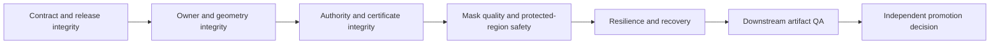

# Wave64 MaskFactory Bridge QA and Promotion Protocol

Updated: 2026-07-17 America/Chicago

## Scope

This protocol defines planning, contract, runtime, fault, visual, autonomy, and
promotion gates for the MaskFactory-to-Main bridge. It does not require human
anchors for core completion. Human-labelled evaluation is an optional profile
for independent real-accuracy claims.

## Gate hierarchy

Every gate is blocking for its exact intended use. Aggregate scores cannot hide
a failed critical dimension.

## G0: Planning-contract gate

Pass requires:

- exactly Rows321-348, contiguous and unique;
- seven workstreams with four rows each;
- Rows177-180 present as transitive parents;
- Row348 transitively reaches every new row and directly depends on Row218;
- strict v2 schemas are Draft 2020-12 meta-valid and reject unknown fields;
- the catalog identifies owner, surface, direction, and producer-wire authority;
- every producer wire contract has an exact adopted name/version/source/hash
  and an executable direction-specific Main-port mapping;
- mapping coverage enumerates every producer and Main top-level path, required
  flags, `map|drop|default|recompute|reject` disposition, versioned transform,
  explicit enum conversion, and non-escalating authority rule;
- producer `use_eligibility` is explicitly dropped and the hash-bound Main
  authority-decision contract recomputes intended-use eligibility;
- every example validates against exactly one record schema;
- authority/access/completion vocabularies match the frozen values;
- Items and Tracker mirrors agree;
- coverage evidence is truthful; and
- preservation-manifest hashes match.

G0 proves planning coverage only.

## G1: Producer release integrity

Test:

- clean source commit/tag and immutable release ID;
- canonical snapshot SHA-256;
- schema source/ID/version/hash for every contract;
- API/OpenAPI, package, ontology, node-pack, wheel, capabilities, certificates,
  revocations, and artifacts;
- archive traversal, extra file, missing file, link escape, and hash mismatch;
- supersession and rollback metadata.

Any mismatch rejects adoption.

## G2: Consumer adoption and drift

Test exact match and deliberate mismatch for:

- schema source;
- schema ID;
- semantic version;
- schema content hash;
- package/API/OpenAPI/ontology/node-pack/wheel version/hash;
- required labels, person counts, transforms, routes, latency, and authority;
- certificate and revocation formats.

`partially_adopted` must enumerate its allowed diagnostic/shadow capabilities.
It cannot authorize unspecified production use.

## G3: Mode A acquisition

Positive fixtures:

- single-character package;
- two-character package with stable explicit mapping;
- cropped/padded/flipped mask with valid inverse;
- certified autonomous issuer;
- optional human issuer without global policy dependence.

Negative fixtures:

- missing package/artifact;
- source hash or dimensions mismatch;
- ambiguous owner/person index;
- unsupported ontology label;
- transform mismatch;
- stale/expired/revoked/wrong-scope certificate;
- package folder implies gold but authority record does not.

## G4: Mode B acquisition

Test health, predict, refine, timeout, retryable failure, non-retryable failure,
unknown submission, duplicate response, late response, cancellation, and
circuit-breaker recovery.

Current expected authority is `draft`. Inject a false `certified` result without
an exact route/output certificate and require rejection. A future positive
certified fixture must bind exact source/output hashes, route, model/runtime,
ontology, scope, issuer, expiry, and revocation check.

Fixture certificates may remain schema-valid for negative and binding tests,
but they must fail any production-certification attempt. Test that
`fixture_only=true`, empty genuine-runtime evidence, or `fixture_validation`
context cannot certify a production result. Test the positive production path
only with `fixture_only=false`, `production_runtime`, a non-empty genuine
runtime evidence set, and a true runtime claim on that certificate record.

## G5: Authority crosswalk

Test all authority states:

- `invalid` never supports execution or promotion;
- `hypothesis` supports planning/diagnosis only;
- `draft` supports policy-bounded preview/QA only;
- `qa_passed_noncertified` supports only explicitly allowed non-certified uses;
- `certified` may satisfy a MaskFactory authority requirement only within exact
  scope and while unexpired/unrevoked.

Test all issuers and reject unknown values. Test every access mode at multiple
authority states to prove that access does not imply authority.

## G6: Ownership and multi-character isolation

For each character, test unique instance ID, provider person index, bbox,
skeleton/depth/silhouette association, target/protected ownership, and
occlusion/contact context.

Faults:

- swapped indices;
- duplicate person index;
- provider reorders detections;
- one person partially occluded;
- overlapping silhouettes;
- owner absent from shot;
- target mask crosses into protected character;
- stale mapping reused on a new frame.

No heuristic assignment may promote without sufficient evidence.

## G7: Transform roundtrip

Exercise identity, crop, resize, pad, horizontal flip, projection, and composed
chains. Bind interpolation and rounding. Map sentinel points, bbox, and mask
boundary forward and inverse. Enforce policy tolerance at source resolution.

Reject:

- missing inverse;
- wrong operation order;
- mismatched source/destination dimensions;
- half-pixel/rounding drift above tolerance;
- mask/image transform divergence; and
- coordinate-space label mismatch.

## G8: Mask and derivation quality

Deterministic checks:

- empty/full/near-empty/near-full masks;
- area and visibility plausibility;
- connected components, holes, islands, topology, and self-inconsistency;
- boundary sharpness/feather policy;
- requested-label coverage;
- target/protected overlap and leakage;
- derived-operation parent hashes and parameters;
- authority ceiling after union/intersection/refine/dilate/feather/project; and
- temporal region continuity for video.

Schema-negative cases must include derived lineage with zero parents and
original lineage with a parent or non-`none` operation. Semantic-negative cases
must include a child whose authority exceeds any parent, a missing parent
authority/certificate record, and an explicit parent certificate ref that does
not match the certificate inside the parent authority. The result authority
must equal the minimum authority across all returned masks.

Critic checks supplement deterministic gates; they do not replace them or
self-promote.

## G9: Autonomous repair

Inject boundary leak, missing region, wrong owner, transform drift, stale mask,
and provider disagreement. Require:

- localized defect and owner;
- immutable accepted parent;
- new hypothesis ID and materially different action;
- target and protected masks;
- bounded attempts, runtime, and candidate count;
- local and whole-artifact regression QA; and
- accept, reroute, quarantine, or abstain outcome.

A seed-only retry or unexplained newest-output selection fails.

## G10: Resilience, cache, and recovery

Inject:

- service offline/startup/shutdown;
- timeout before and after submission;
- connection reset and malformed response;
- duplicate request and duplicate result;
- restart at every durable event boundary;
- lease loss;
- disk-full/partial-write simulation;
- stale health and stale cache;
- schema/ontology/release/route/model/certificate invalidation;
- event replay with tombstones; and
- rollback to a prior non-revoked release.

Require no duplicate confirmed side effects, no stale resurrection, bounded
retry, exact incident state, and unrelated-DAG continuation.

## G11: Downstream edit and regression QA

For a mask-dependent image/video pass, compare before/after:

- intended region improvement;
- protected-region pixel/perceptual change;
- identity and morphology preservation;
- boundary seam, halo, texture, color, grain, and lighting continuity;
- whole-frame or whole-clip regression;
- multi-character ownership; and
- artifact lineage and hashes.

Mask certification alone never promotes the edited artifact.

## G12: App and observability

Verify the generated App registry contains exactly Home/readiness,
Projects/revisions, Scene Builder Pose & Masks, Runs/DAG, Queue/Workers,
Recovery, and QA. Verify each page uses only its registered read models and
field paths. Validate a strict readiness-projection v2 fixture containing
project/revision, release/adoption, Row218, Rows321-347, Row348, all three
completion profiles, all seven page summaries, event cursor, runtime evidence,
and blockers. A fixture projection must never display runtime ready or released.

Verify browser/App cannot:

- enter raw producer paths;
- call a production service outside the controller gateway;
- mutate MaskFactory gold;
- change authority/certificate fields;
- bypass a blocker; or
- commit downstream promotion.

## G13: Integrated release

After Row218, run:

1. single-character Mode A Character-to-Image pass;
2. two-character ownership/protected-region pass;
3. Mode B draft preview or repair path;
4. service-offline dependent-pass blocker with unrelated branch continuation;
5. revocation/invalidation and safe cache behavior;
6. restart/replay during one in-flight request; and
7. downstream promotion gate with immutable evidence.

Row348 `core_autonomous_runtime` release requires all core gates. The certificate
must explicitly state that `independent_real_accuracy` and
`scale_daz_maturity` are optional and separately evaluated.

The Row348 record must use production context, `fixture_only=false`, a non-empty
set of genuine runtime evidence refs, `runtime_completion_claimed=true`,
Row218 passed, Rows321-347 passed, and every blocking check passed. Negative
tests must reject a copied fixture, a released status with `release_allowed`
false, and any production release missing genuine runtime evidence.

## Promotion decision table

| Condition | Diagnostic | Preview | Downstream promotion-bound use |
|---|---:|---:|---:|
| `invalid` | No | No | No |
| `hypothesis` | Yes | No | No |
| `draft` | Yes | Policy-bounded | No |
| `qa_passed_noncertified` | Yes | Yes | Only if downstream policy explicitly does not require certification |
| `certified`, exact valid scope | Yes | Yes | Eligible, subject to downstream QA/promotion |
| Any state with hash/scope/revocation failure | No | No | No |

Access mode does not change this table.

The normalized acquisition result never owns this decision. Eligibility is
derived in `maskfactory_authority_decision_v2` from a named/hash-bound consumer
policy, exact intended use, required authority, allowed issuer/scope, structured
criteria, evidence, revocation state, and blockers. Preview or repair policies
may accept lower authority; a production policy may require `certified`.

## Optional independent review profiles

### `independent_real_accuracy`

If selected, define corpus sampling, blindness, annotator protocol, disagreement,
confidence intervals, stratification, held-out data, false-accept metrics, and
claim wording. This profile may use human anchors/CVAT; its absence does not
fail core.

### `scale_daz_maturity`

If selected, define package/corpus scale, DAZ asset coverage, renderer/runtime
qualification, capacity, storage, cost, and soak duration. Its absence does not
fail core.

## Evidence packet

Every gate emits record/schema versions, exact hashes, environment/runtime
identity, test/fixture IDs, raw observations, deterministic decisions, critic
versions, blockers, attempts, timestamps, and final outcome. Human evidence, if
used, declares issuer `human_anchor_optional`; autonomous certificates declare
`maskfactory_autonomous`.

No passing average overrides a failed blocking gate.

## Second-pass adversarial assurance matrix

The bridge cannot advance beyond fixture validation until its suite proves every
row below in both positive and fail-closed form.

| Surface | Required positive proof | Required rejection proof |
|---|---|---|
| Signer trust | Active Ed25519 key matches the pinned out-of-band Main registry | Embedded/self-signed, substituted, unknown, expired, or revoked key |
| Certificate time | Issued before decision, decision before expiry, current revocation index, not revoked | Future-issued, expired, revoked, or stale revocation index |
| Canonical payload | Exact release-bound profile/domain/exclusions and stable hash/signature | Duplicate keys, non-finite values, ambiguous profile, wrong domain/exclusions |
| Request security | Authorized principal/route, unique nonce, exact payload/idempotency binding | Nonce replay, stale timestamp, wrong capability, payload substitution |
| Release import | Manifest-first isolated extraction, limits, post-extract hashes, atomic activation | Traversal, absolute/drive/UNC/device path, link/reparse escape, collision, expansion abuse |
| Ownership | Exact target plus protected character/prop/environment roster | Swapped/duplicate/absent target, undeclared owner, cross-character alias |
| ROI/output | Independent input-region and generated-output hashes | Undeclared identity collision; permit only explicit Mode A exact selector |
| Transform | Typed continuous steps, correct side swaps, inverse and bounded roundtrip | Wrong parameters/dimensions/order/rounding/side, non-invertible or excess error |
| Media scope | Exact still, frame, or span with hash/PTS/timebase/temporal evidence | Reuse on another frame, widened span, whole-clip authority inference |
| Runtime provenance | Native/venv environment+lock hashes or container image digest | Missing conditional binding, mutable tag/path, runtime-kind mismatch |
| Execution facts | Exact attempt/hypothesis/route/reason/alternatives/resources/timing | Route identity drift, resource/deadline contradiction, factual record used as authority |
| Lifecycle | Registered forward path and reconciled `outcome_unknown` | Backward/unlisted transition, terminal transition, blind resubmission |
| Journal | Trusted bootstrap/checkpoint/head with complete hash/signature sequence | Fork, gap, deletion, reorder, reseal, checkpoint/key substitution |
| Claim class | Exact operational core use under pinned policy | Operational artifact treated as independent accuracy or training gold |
| Promotion policy | Complete unique signed criterion set recomputed from evidence | Missing/duplicate/invented criterion, changed threshold, self-declared status, producer eligibility |
| Fixture firewall | Fixtures validate schemas and faults only | Fixture certificate, result, decision, policy, readiness, or release becomes production evidence |
| Adoption chain | Exact non-fixture release/adoption refs, hashes, runtime evidence, three trusted signatures, passing checks, active pin | Fixture release/adoption, wrong ref/hash, absent evidence, self-declared active pin, incomplete trigger table |
| Row348 gate set | Exactly Row218 plus Rows321-347, one hashed/signed/evidenced report per gate, derived aggregates | Missing/duplicate/unknown gate, wrong report hash, untrusted/evidenceless gate, caller-supplied aggregate contradiction |
| App/LLM boundary | Read-only registered projections and schema-bound proposals | Raw path/endpoint use, policy mutation, self-promotion, conversation summary as truth |
| Readiness | Actual release/adoption/Row348 refs and page gate subsets, exact evidence union, current journal, no core blocker | Isolated self-declaration, stale ref/gate/checkpoint, incomplete page/evidence projection, optional blocker treated as core |
| Invalidation | Raw producer payload plus exact heterogeneous target transitions, actions, unions, stream/idempotency/supersession | Flattened targets, lost old/new state, wrong union, unrelated-scope mutation, wrong superseding ref, divergent idempotency replay |
| Revalidation lifecycle | Every invalidation reason has one exact trigger/action/scope and trust/journal requirements | Missing signer/artifact/capability/policy/node/journal/revocation trigger or silent fallback |

Every rejection must produce the typed blocker, exact affected scope, immutable
evidence reference, and dependent-pass behavior. Aggregate visual or numerical
scores cannot hide one failed blocking criterion. For video/frame-span outputs,
test target frames, temporal neighbors, span boundaries, and whole-clip regression.

The final producer-binding test must run directly against the frozen MaskFactory
root and pass all 12 schema name/ID/version/hash/property/required comparisons.
Until that packet exists, preview hashes remain provisional and cannot satisfy
release adoption.
